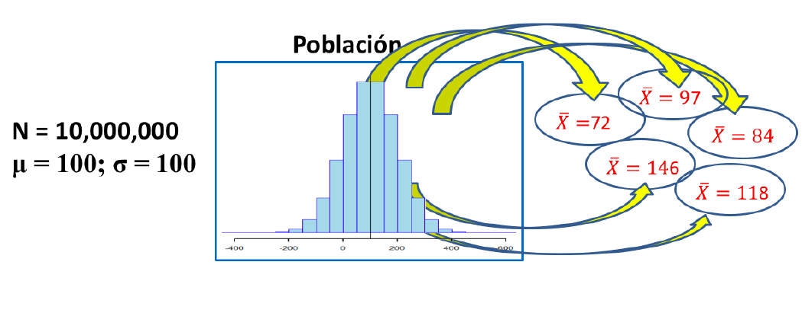
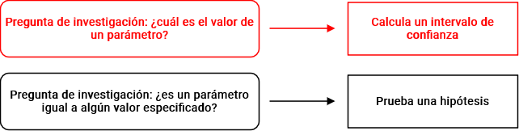
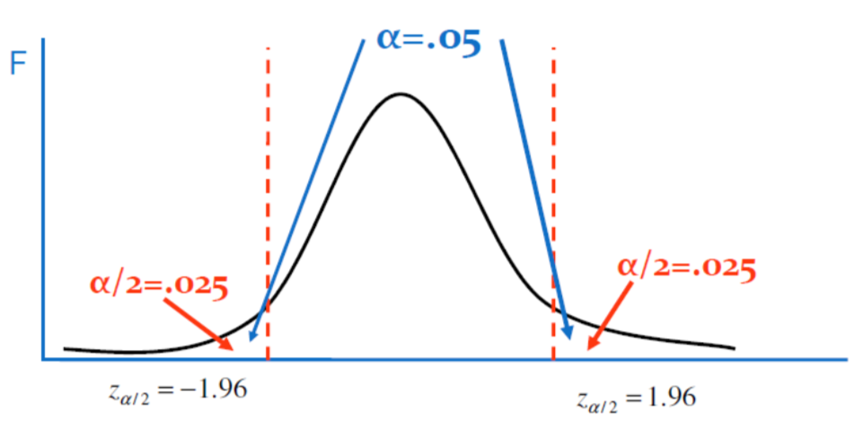

class: front

```{r setup, include=FALSE, cache = FALSE}
library(knitr)
opts_chunk$set(warning=FALSE,
             message=FALSE,
             echo=TRUE,
             comment = "",
             cache = FALSE, fig.width=10, fig.height=8)
pacman::p_load(flipbookr, tidyverse, kableExtra, srvyr)
```


```{r xaringanExtra, include=FALSE}
xaringanExtra::use_xaringan_extra(c("tile_view", "animate_css"))
xaringanExtra::use_scribble()
```

```{r calculos, echo=FALSE, include=FALSE, eval=TRUE}

load(url("https://github.com/cursos-metodos-facso/datos-ejemplos/raw/main/esi-2021-ocupados.rdata"))

esi_pond <- esi %>% as_survey_design(ids = 1, # indica conglomerados de muestreo; ~0 o ~1 cuando no hay
                                     strata = estrato, # indica efecto de diseño muestral
                                     weights = fact_cal_esi) # indica el ponderador

options(survey.lonely.psu = "certainty") # seteamos para que ids no moleste

t1 <- esi_pond %>% 
  summarise(media = survey_mean(ing_t_p, vartype = NULL),
            sd = survey_sd(ing_t_p),
            N = n()) %>% 
  pivot_longer(cols = everything(),
               names_to = "name",
               values_to = "value") %>% 
  kableExtra::kable(format = "html", align = 'c', col.names = c("Estadístico", "Valor")) %>% 
  kableExtra::kable_styling(full_width = F, position = "left", bootstrap_options = "striped") %>% 
  column_spec(1, bold = T) %>% 
  row_spec(0, bold = T)
  
```


.pull-left-wide[
# Estadística Correlacional]

.pull-right-narrow[]

## Asociación, inferencia y reporte

----
.pull-left[

## Andreas Laffert
## Sociología FACSO - UChile
## 2do Sem 2023 
## [.orange[correlacional.netlify.com]](https:/correlacional.netlify.com)
]

.pull-right-narrow[
.center[
.content-block-gray[
## Sesión 7: 
## .orange[Inferencia 3: Pruebas de hipótesis para variables cuantitativas]]
]
]
---
layout: true
class: animated, fadeIn

---
class: roja

## .yellow[Objetivos de la sesión de hoy]


### 1. Comprender la lógica del contraste de hipótesis

### 2. Utilizar intervalos de confianza como prueba de hipótesis

### 3. Aplicar prueba T de Student para diferencias de medias

---
class: roja right

.pull-left-narrow[
# .black[Contenidos]
]

<br> 
.pull-right-wide[

### .yellow[1- Resumen sesión anterior]

### 2- Intervalos de confianza como prueba de hipótesis

### 3- Lógica del contraste de hipótesis

### 4- Prueba T de Student para diferencia de medias

]
---

# Inferencia

.center[

.pull-left-narrow[

<br>


]
]

.pull-right-wide[


- Llamamos .bold[inferencia] al ejercicio de .bold[extrapolar] determinadas estimaciones .green[(estadístico)] de una muestra a una población más grande .red[(parámetro)].

{{content}}

]

--

- **¿En qué medida podemos hacer inferencias desde nuestra muestra a la población?**

{{content}}

--

- Un concepto central es la probabilidad de **ERROR**


---
# Distribución muestral

.box-inv-4.medium.sp-after[
Es la distribución de una estimación (por ej. $\bar{X}$ de IQ) en base a todas las posibles muestras que podemos obtener de una población.

]
--

.mlarge[
Si en cada muestra calculamos $\bar{X}$, veremos que varía de una muestra a otra. Estos .bold[posibles valores del estadístico constituyen su distribución muestral].]


.center[]

---
# Distribución muestral y error estándar


.pull-left-narrow[

.mlarge[

Pero, trabajar con muestras implica que siempre tenemos **error**.

- Caso canónico es el _promedio muestral_, para el cual sabemos que: $\bar{X} \sim \text{Normal}(\mu,\frac{\sigma}{\sqrt{n}})$


- La desviación estándar del **estimador** (en este caso, $\frac{\sigma}{\sqrt{n}}$ ) es lo que denominamos **error estándar (SE)**

]
]
--
.pull-right-wide[


]
---

# Teorema del límite central

.medium[
Si tengo **una sola muestra**, pero esta es lo suficientemente grande (.bold[N] > 30):]

--
.pull-left[

.content-box-red[
.medium[
La .red[distribución muestral] del $\bar{X}$ se aproxima a una distribución normal con:

$\bar{X} \sim \text{N}({\mu}_\bar{X},{\sigma}_\bar{X})$

 - $\mu$ = promedio de la población
 - $\sigma$ = desviación estándar de la población

]
]
]

--
.pull-right[

.content-box-yellow[

.medium[


La .red[desviación estándar de los promedios] (error estándar) equivale a:

$$\sigma_{\bar{X}}=SE(error estándar)=\frac{s}{\sqrt{N}}$$

 - $s$ = desviación estándar de la muestra
 - $N$ = tamaño de la muestra
]

]


]


---
# Inferencias

¿Cómo podemos **inferir** a la población en situaciones de **incertidumbre**?:


.center[]


---
# Intervalos de confianza I

.pull-left-narrow[
.medium[

- Nuestro promedio muestral $\bar{x}$ posee una distribución normal con una desviación estandar = SE (error estándar)

- Esto nos permite estimar probabilidades de ocurrencia basados en los valores de la curva normal

]
]
.pull-right-wide[
.center[]]


---
# Intervalos de confianza II

.pull-left-wide[
.center[]]


.pull-right-narrow[
.medium[

- Por ejemplo, un intervalo de confianza de $\bar{x}\pm1.96SE$ abarca aproximadamente el 95% de los valores probables

- En este caso, puedo decir que el promedio se encuentra en un rango de valores con un .red[nivel de confianza] de 95%


]
]


---
.center[

]
---
# Intervalos de confianza II

Ejemplo: Si quisiera conocer el $\mu$ de ingresos de **todas las personas** ocupadas en Chile, basta con obtener la _estimación puntual_ de la muestra... Pero,

--
.content-box-red[
.red[
¿cómo sabemos si dicha estimación es .bold.green[buena]?

¿qué tan .bold.green[confiad_s] estamos de que .bold.green[capturamos] el verdadero parámetro poblacional?
]
]
---
# Intervalos de confianza III
.box-4.sp-after-half[Un rango de valores plausibles que pueden contener el verdadero parámetro poblacional]

.pull-left-narrow[
.center[]]

.pull-right-wide[
.center[]]

---

## Ejemplo: intervalo de confianza para la media

.pull-left[

Tenemos estos datos de ingresos (ESI 2021):

```{r echo=FALSE}
t1
```

]

--
.pull-right[

Sabemos que un IC para $\mu$ y $SE$ poblacional desconocidas en una muestra representativa es:

 $$\bar{X}\pm Z_{\alpha/2} * \frac{s}{\sqrt{N}}$$


]
--

.pull-right[

Si cálculamos con un 95% de confianza...

]

---
## Ejemplo: intervalo de confianza para la media

Cálculo directo en `R`:

.medium[
```{r}
esi_pond %>% 
  summarise(media = survey_mean(ing_t_p, vartype = "ci", levels = 0.95, na.rm=T))
```

]

- Tenemos que, .red[con un 95% de confianza], el promedio de ingresos se encuentra entre 666.563 y 695.516

---
## Ejemplo: intervalo de confianza para la media


imagen

---
# ¿Confianza en qué?

- bajo esta lógica, la confianza está en que si tuvieramos la posibilidad de extraer múltiples muestras, el 95% de las veces nuestro intervalo contendría el promedio

- o que existe un 5% de probabilidad de error, es decir, que el promedio de la muestra no sea el de la población

- o que las chances de error son 1 de 20 

---

.center[]

---
class: roja right

.pull-left-narrow[
# .black[Contenidos]
]

<br> 
.pull-right-wide[

### 1- Resumen sesión anterior

### 2- .yellow[Intervalos de confianza como prueba de hipótesis]

### 3- Lógica del contraste de hipótesis

### 4- Prueba T de Student para diferencia de medias

]
---


